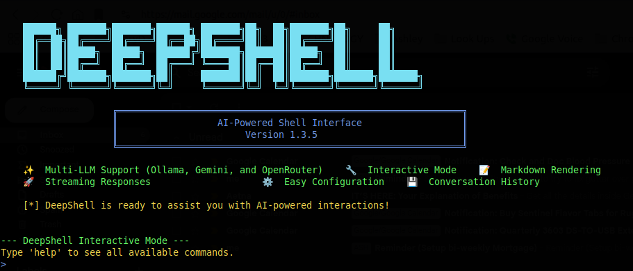

# DeepShell

**Your Universal LLM Command-Line Interface**



[](https://gcc.gnu.org/)

**DeepShell** is a powerful and versatile command-line program written in C that seamlessly blends the familiar environment of your local shell with the immense knowledge and capabilities of Large Language Models (LLMs). Imagine having direct access to the world's most advanced AI models—from local Ollama instances to cloud-based services like Google's Gemini—all unified within a single, efficient native binary.

Designed for developers, researchers, and power users, DeepShell abstracts away the complexity of API integrations. It offers a streamlined pathway to query both open-source and proprietary LLMs, transforming your command prompt into a conduit for deep AI intelligence with native performance.

## ✨ Features

*   **Multi-LLM Support:**
    *   Seamlessly connect to **Ollama** servers (local or remote).
    *   Integrate with the **Google Gemini API**.
    *   Connect to **OpenRouter.ai** for access to 200+ LLM models from various providers.
        *   Advanced model selection with pagination and sorting (free models first).
        *   Multi-key management with nicknames for different OpenRouter accounts.
*   **Conversational Memory & Customization:**
    *   Engage in multi-turn conversations using the **interactive mode** (`-i`).
    *   Set the conversation history limit (defaults to 25 turns).
    *   Toggle response streaming for immediate (plain-text) or complete (Markdown-rendered) output. Streaming is disabled by default to preserve formatting.
    *   Enable or disable Markdown rendering for each LLM service individually.
*   **Unified & Interactive Configuration:**
    *   A central, user-friendly settings menu (`-s`) guides you through all configuration tasks.
    *   Manages LLM service details, including server addresses (Ollama) and API keys (Gemini).
    *   Stores configuration securely in `~/.deepshell/deepshell.conf`.
*   **Flexible Service & Model Management:**
    *   Easily switch between configured LLM services (`-l`).
    *   Quickly jump back to the previously used LLM service (`-j`).
    *   List available models from your connected LLM service and change the default model per service (`-m`).
*   **Advanced API Key Management:**
    *   Store and manage multiple API keys with user-defined nicknames for both Gemini and OpenRouter.
    *   Unified key management interface (`-set-key`) supporting both services.
    *   Display the currently active API key for any LLM service (`-show-key`).
    *   Quick active configuration summary showing current LLM, model, and API key (`-a`).
    *   Gemini-specific quota checking and usage dashboard access (`-gq`).
*   **Configuration Backup & Migration:**
    *   Export complete configuration to encrypted files (`-b`) with password protection.
    *   Import configuration from backup files (`-c`) with confirmation prompts.
    *   Files saved to Downloads folder in secure binary format (unreadable as text).
    *   Future-proof design with version metadata for cross-version compatibility.
    *   Perfect for backing up settings, sharing configurations, or migrating between systems.
*   **Intuitive User Experience:**
    *   Send queries directly from your command line (`-q`).
        *   Beautiful Markdown rendering for LLM responses in the terminal with native C implementation.
    *   Engaging progress animation while waiting for the LLM.
    *   Clear, colored console output for enhanced readability.
    *   Well-formatted and alphabetized help messages (`-h`).

## 🛠️ Installation

### 📦 **Quick Install (Recommended)**

**For Ubuntu/Debian systems:**

```
# Download the appropriate .deb package for your system
wget https://github.com/ashes00/deepshell/releases/download/v1.3.1/deepshell-1.3.1-ubuntu-20.04.deb

# Install the package
sudo dpkg -i deepshell-1.3.1-ubuntu-20.04.deb

# Install any missing dependencies
sudo apt-get install -f
```

**For other Linux distributions:**

*   Check the [releases page](https://github.com/ashes00/deepshell/releases) for pre-built packages
*   Look for packages matching your distribution and architecture

### 📦 **RPM Package Installation (RHEL/CentOS/Fedora)**

**For RPM-based systems (RHEL, CentOS, Fedora, openSUSE):**

**Install the RPM package:**

1. **Visit the releases page:** [https://github.com/ashes00/deepshell/releases](https://github.com/ashes00/deepshell/releases)
2. **Download the appropriate RPM package** for your system architecture
3. **Import the GPG key and install:**

```
# Download and import the GPG key
curl -fsSL https://github.com/ashes00/deepshell/releases/download/v1.3.1/deepshell-public.key | sudo rpm --import -

# Install the downloaded RPM package (replace with your actual filename)
sudo rpm -i deepshell-*.rpm

# Verify installation
deepshell --version
```


## 🏁 Getting Started: Initial Setup

The first time you run DeepShell, or anytime you want to manage settings, use the `-s` or `--setup` flag:

```
./deepshell -s
```

This launches a comprehensive, interactive menu that allows you to:

1.  **Add or Reconfigure LLM Services:**
    *   **For Ollama:** Enter your server address (e.g., `http://localhost:11434`) and select a default model from those available on your server.
    *   **For Gemini:** Manage your API keys (add, remove, set active) and select a default model from the Gemini API.
2.  **Switch** the active LLM service.
3.  **Change** the default model for the currently active service.
4.  **Manage** Gemini API keys specifically.
5.  **View** your current configuration or **delete** it entirely.
6.  **Toggle Markdown Rendering:** Enable or disable Markdown formatting for the active service's responses.
7.  **Set Interactive History Limit:** Change the number of conversation turns remembered in interactive mode.
8.  **Toggle Response Streaming:** Enable or disable streaming responses. (Note: Markdown is not supported in streaming mode).

Your settings will be saved to `~/.deepshell/deepshell.conf`.

## 💻 Usage & Command-Line Options

### Primary Usage

**Query the active LLM**

```
./deepshell -q "What are the benefits of using a CLI for LLM interaction?"
./deepshell --query "Write a function to calculate a factorial"
```

### LLM & Model Management

**Enter the main settings menu**

```
./deepshell -s (or --setup)
```

**Switch active service or configure services** (shortcut to a settings sub-menu)

```
./deepshell -l (or --llm)
```

**Quickly jump to the previously used LLM service**

```
./deepshell -j (or --jump-llm)
```

**Change the default model for the active service** (shortcut)

```
./deepshell -m (or --model-change)
```

### API Key Management

**Interactively manage API keys for LLM services** (Gemini or OpenRouter)

```
./deepshell -set-key (or --set-api-key)
```

**Show the active API key for current LLM service**

```
./deepshell -show-key (or --show-api-key)
```

**Quick summary of active LLM, model, and API key**

```
./deepshell -a (or --active-config)
```

**Check Gemini API key status and get quota info**

```
./deepshell -gq (or --gemini-quota)
```

### Configuration Backup & Migration

**Export configuration to encrypted backup file**

```
./deepshell -b mybackup.config (or --export mybackup.config)
```

**Import configuration from encrypted backup file**

```
./deepshell -c mybackup.config (or --import mybackup.config)
```

### Configuration & Info

**Display the currently active configuration details**

```
./deepshell -show-config (or --show-full-conf)
```

**Delete the entire configuration file** (use with caution!)

```
./deepshell -d (or --delete-config)
```

**Show the help message**

```
./deepshell -h (or --help)
```

**Show the program's version**

```
./deepshell -v (or --version)
```

**Start an interactive chat session**

```
./deepshell -i (or --interactive)
```

## ⚙️ Configuration File

DeepShell stores its configuration in a JSON file located at `~/.deepshell/deepshell.conf`. While you can view this file, it's recommended to manage settings through DeepShell's command-line options for safety and ease of use.

An example configuration might look like this:

```
{
    "active_llm_service": "openrouter",
    "previous_active_llm_service": "gemini",
    "interactive_history_limit": 25,
    "enable_streaming": false,
    "show_progress_animation": true,
    "ollama": {
        "server_address": "http://localhost:11434",
        "model": "llama3:latest",
        "render_markdown": true
    },
    "gemini": {
        "api_keys": [
            {
                "nickname": "personal-key",
                "key": "AIza..."
            }
        ],
        "active_api_key_nickname": "personal-key",
        "model": "models/gemini-1.5-flash",
        "render_markdown": true
    },
    "openrouter": {
        "api_keys": [
            {
                "nickname": "work-account",
                "key": "sk-or-v1-..."
            }
        ],
        "active_api_key_nickname": "work-account",
        "model": "openai/gpt-4o",
        "site_url": "https://myproject.com",
        "site_name": "My Project",
        "render_markdown": true
    }
}
```

## 🚀 Performance Benefits

The C version offers several advantages over interpreted languages:

*   **Faster startup time**: No interpreter overhead
*   **Smaller executable**: Single binary with minimal dependencies
*   **Lower memory usage**: More efficient memory management
*   **Better system integration**: Native system calls
*   **Extended timeouts**: 30-second request timeout for better compatibility with slower models

## 🤖 Supported LLMs

---

*   **Ollama:** Connect to any Ollama instance serving models like Llama, Mistral, etc.
*   **Google Gemini:** Access Gemini models (e.g., `gemini-1.5-pro`, `gemini-1.5-flash`) via the Google AI Studio API.
*   **OpenRouter.ai:** Access 200+ models from providers like OpenAI, Anthropic, Meta, Google, and more:
    *   GPT-4, GPT-3.5, Claude, Llama, Mixtral, Gemma, and many others
    *   Free and paid models with transparent pricing
    *   Advanced model browser with pagination and sorting (free models first)
    *   Multi-account support with API key nicknames

---

## ⚙️ Pro Tip

Copy deepshell to your Environment path:

Create aliases for ds & dsq for quick keyboard actions:

Save .bashrc file:

Update your .bashrc file to use commands:

Use the alias `dsq` to quickly query the LLM:

Use the alias `ds` to quickly access features with options:

Use the alias `dsi` to enter interactive mode:

Happy Querying!!!

```
dsi
```

```
ds -v
```

```
dsq What is the best LLM?
```

```
source .bashrc
```

```
Ctrl+s & Ctrl+x
```

```
nano .bashrc 
alias dsq="deepshell -q"
alias ds="deepshell"
alias dsi="deepshell -i"
```

```
sudo cp deepshell /usr/local/bin/
```

## 🔧 Developer Guide

### Prerequisites

Before building DeepShell from source, ensure you have the following dependencies installed:

**Required Libraries:**
- `gcc` - C compiler and build tools
- `libcurl4-openssl-dev` - For HTTP/HTTPS requests
- `libjson-c-dev` - For JSON parsing and manipulation
- `libreadline-dev` - For interactive command-line features

### Building from Source

**1. Clone the Repository:**

```bash
git clone https://github.com/ashes00/deepshell.git
cd deepshell
```

**2. Install Dependencies:**

**For Ubuntu/Debian systems:**
```bash
sudo apt-get update
sudo apt-get install -y libcurl4-openssl-dev libjson-c-dev libreadline-dev gcc make
```

**For RHEL/CentOS/Fedora systems:**
```bash
sudo yum install -y libcurl-devel json-c-devel readline-devel gcc make
# or for newer versions:
sudo dnf install -y libcurl-devel json-c-devel readline-devel gcc make
```

**For openSUSE systems:**
```bash
sudo zypper install -y libcurl-devel libjson-c-devel readline-devel gcc make
```

**3. Build DeepShell:**

```bash
make
```

**4. Run DeepShell:**

```bash
./deepshell --help
```

### Development Commands

**Clean build artifacts:**
```bash
make clean
```

**Build with debug information:**
```bash
make debug
```

**Build optimized release version:**
```bash
make release
```

**Install dependencies automatically (Linux only):**
```bash
make install-deps-linux
```

### Project Structure

The DeepShell C codebase consists of the following main components:

- `main.c` - Entry point and command-line argument parsing
- `settings.c` - Configuration management and settings menu
- `gemini.c` - Google Gemini API integration
- `ollama.c` - Ollama server integration
- `openrouter.c` - OpenRouter.ai API integration
- `interactive.c` - Interactive chat mode implementation
- `utils.c` - Utility functions and helpers
- `config.c` - Configuration file I/O operations
- `deepshell.h` - Header file with function declarations and constants

### Contributing

1. Fork the repository
2. Create a feature branch (`git checkout -b feature/amazing-feature`)
3. Make your changes and test thoroughly
4. Commit your changes (`git commit -m 'Add some amazing feature'`)
5. Push to the branch (`git push origin feature/amazing-feature`)
6. Open a Pull Request

### Build Requirements Summary

| Component | Purpose | Package Name (Ubuntu/Debian) |
|-----------|---------|------------------------------|
| C Compiler | Compile source code | `gcc` |
| Build Tools | Make system | `make` |
| HTTP Library | API requests | `libcurl4-openssl-dev` |
| JSON Library | JSON parsing | `libjson-c-dev` |
| Readline Library | Interactive features | `libreadline-dev` |

### License

This project is licensed under the **UNLICENSE**.

Happy Querying!!!